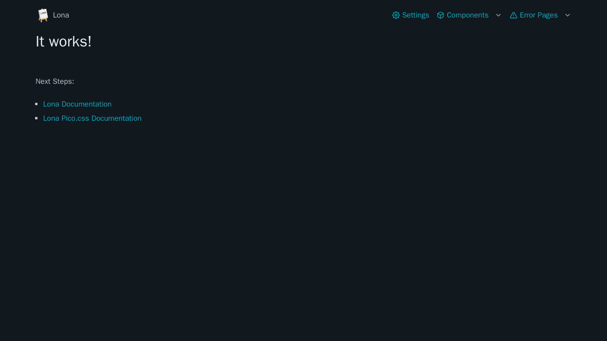
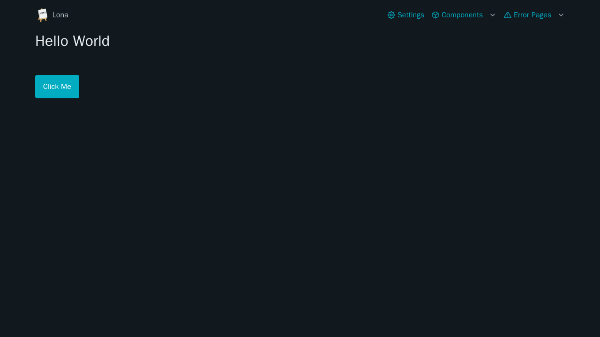

# Getting Started

Put these lines into a new Python file:

```python
# hello-world.py

from lona_picocss import install_picocss
from lona import App

app = LonaApp(__file__)

install_picocss(app, debug=True)  # remove 'debug' in production

app.run()
```

Then run:

```
python3 hello-world.py --port=8080
```

The script should open a webserver on `http://localhost:8080` showing the "It works" page.



`lona_picocss.install_picocss` updates the settings of your Lona app object to use the lona-picocss frontend and error views. When `debug` is set to `True`, the [configurator](./customization.md#customization), and some component demos are available in `/_picocss/`.


## Hello World

`lona_picocss.html` is a drop-in-replacement for all [Lona HTML components](https://lona-web.org/1.x/end-user-documentation/html.html), and contains a collection of [Pico.css specific custom components](./components.md).

```python
# hello-world.py

from lona_picocss.html import HTML, H1, InlineButton
from lona_picocss import install_picocss
from lona import App, View

app = LonaApp(__file__)

install_picocss(app, debug=True)  # remove 'debug' in production


@app.route('/')
class HelloWorldView(View):
    def handle_button_click(self, input_event):
        self.button.set_text('I was clicked')

    def handle_request(self, request):
        self.button = InlineButton(
            'Click Me',
            handle_click=self.handle_button_click,
        )

        return HTML(
            H1('Hello World'),
            self.button,
        )


app.run()
```


